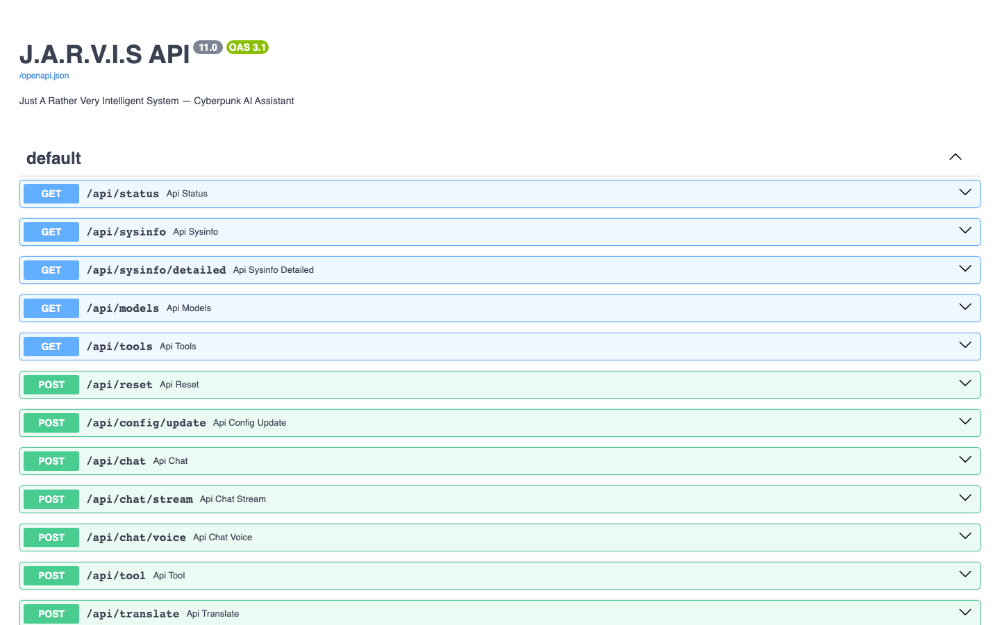

# J.A.R.V.I.S -- Just A Rather Very Intelligent System

## Overview

J.A.R.V.I.S is a cyberpunk-themed AI assistant for macOS, designed as a full-stack application with a Python/FastAPI backend and a Vite/TypeScript frontend. It provides multi-modal interaction through text, voice, vision, image generation, and music generation, with deep integration into macOS system controls and Home Assistant smart home automation. The system is multilingual, supporting Italian, German, and English.

The project features over 120+ unified tools accessible via both a REST API and an LLM agent with smart tool routing, enabling capabilities ranging from file management and browser automation to video analytics and multi-agent orchestration.

---

## Screenshots

<div align="center">
  <table>
    <tr>
      <td></td>
      <td></td>
    </tr>
    <tr>
      <td align="center"><em>Chat Interface</em></td>
      <td align="center"><em>System Dashboard</em></td>
    </tr>
    <tr>
      <td></td>
      <td></td>
    </tr>
    <tr>
      <td align="center"><em>API Documentation (Swagger)</em></td>
      <td align="center"><em>Settings Panel</em></td>
    </tr>
  </table>
</div>

---

## Features

### System Control
- Open, quit, and manage macOS applications
- Volume and brightness control
- Clipboard read/write
- macOS notifications and reminders
- Lock screen, show desktop, music playback control
- System information (battery, CPU, RAM, disk, IP, uptime)

### Calendar
- Google Calendar integration via AppleScript
- View today's events and upcoming events
- Create new calendar events
- List available calendars
- Open Calendar app

### Mail
- Apple Mail integration via AppleScript
- Read unread email count
- Fetch recent emails
- Search through emails
- Send email with CC/BCC support
- Read aloud unread emails

### Notes
- Apple Notes integration via AppleScript
- Create, search, and list notes
- Read note content

### Screen
- Screen OCR (Optical Character Recognition) via Apple's Vision framework + Tesseract
- Screen awareness summary (visible apps, windows, context)
- Extract selected text from active application
- Screenshot capture (full screen, window, selection)

### Web
- Browser tab listing (Chrome)
- Current page content extraction via JavaScript injection
- Page scrolling (up, down, top, bottom)
- Playwright-powered browser automation: navigate, click, fill forms, extract content, take screenshots

### Computer Use
- Mouse control: move, click (left/right/double), drag, scroll
- Keyboard control: type text, press keys, keyboard shortcuts
- Get mouse position and screen resolution

### Files
- List, read, create, and search files
- Create directories
- Copy, move, rename, and delete files
- Get file info
- Organize Downloads folder by file type

### Memory
- SQLite-based persistent memory with FTS5 full-text search
- Store facts, preferences, and conversation history
- Categorized memories with tags and importance levels
- Knowledge Graph for entity extraction and relationship mapping
- Preference key-value store
- Automatic WAL mode and checkpointing for performance

### Shortcuts
- Run macOS Shortcuts by name
- List all available shortcuts

### Planner
- Create multi-step plans
- Track active plans with step completion
- Priority-based planning (low, medium, high)

### Web Search
- DuckDuckGo search with structured results (no API key required)
- Google search fallback

### Git
- Repository status, log, branches, and diff
- Commit changes and create branches
- Execute arbitrary git commands

### RAG (Retrieval-Augmented Generation)
- Sentence-transformers embeddings (all-MiniLM-L6-v2) for semantic search
- SQLite FTS5 hybrid search (keyword + cosine similarity)
- Document ingestion from files and folders
- Add, update, delete, list, and search documents
- Semantic-only search mode
- Re-embed all documents after model change
- Deduplication by similarity threshold
- Full database export to JSON
- Search by source path

### Approval System
- Request/approve/deny tool execution
- Pending requests queue
- Auto-approve future requests from trusted sources
- Full audit trail of all requests

### Goals & Key Results (OKR)
- Create goals with measurable key results
- Track progress with numeric targets
- List, detail, archive, and delete goals
- Add key results to existing goals

### LLM Provider Management
- Switch between LLM providers at runtime (Groq, Ollama, OpenAI, Gemini, Anthropic, IONOS)
- Change models per provider
- List available providers with status
- Estimate costs per provider

### Network
- Public IP and geolocation
- Ping test, DNS lookup, port check
- Bandwidth speedtest
- Full connectivity summary

### Image Generation
- AI image generation via IONOS Hub (FLUX.1-schnell model)
- Multiple sizes: 1024x1024, 1024x1792, 1792x1024
- List available models

### Music Generation
- AI music generation via ACE-Step 1.5 (local GPU)
- Multiple genres: electronic, ambient, cinematic, lo-fi, synthwave, jazz, classical
- Configurable duration (up to 240 seconds) and temperature
- List available genres and generator status

### WhatsApp Integration
- OpenWA bridge (Node.js + Baileys WhatsApp Web JS)
- Send text messages, images, and files
- Automatic session management with QR code authentication
- Webhook for receiving messages with auto-reply
- Voice message transcription via Whisper
- Image generation + WhatsApp send workflow
- Group chat support

### Telegram Bot
- Send messages via Telegram bot
- Bot status check
- Configurable chat ID

### Video Analytics
- MLX-powered motion detection with YOLO-style object detection
- Vehicle and person tracking with speed estimation
- Virtual detection line for counting
- RTSP/HTTP stream and webcam support
- MJPEG stream for live view
- Session-based counting with database persistence
- Speed calibration

### Knowledge Graph (GitNexus)
- Repository structure analysis (files, languages, statistics)
- Build knowledge graph with entities, relationships, file dependencies
- Symbol extraction (functions, classes, imports)
- Code search across repository
- GitNexus status check

### World News / Trends
- GDELT-powered world news with geolocated interactive map
- News sources: BBC, NYT, ANSA, Tagesschau
- Trend search by category (technology, AI, social, startup, opensource, German, Italian)
- Regional trend monitoring

### Vision
- Image analysis: objects, text, QR codes, faces, dominant colors
- Apple Vision + Tesseract OCR for text extraction
- QR and barcode detection
- AI-powered image description (Ollama llava)
- Region capture and analysis
- Face detection

### Voice
- Text-to-speech via PlayAI or macOS `say` command
- Speech-to-text via microphone
- List available voices
- Change active voice at runtime

### OS Control (macOS Native)
- List and manage windows (focus, move, minimize, maximize, tile)
- List running applications with details
- Window grid arrangement (2x2)
- System Preferences pane shortcuts
- Toggle dark mode, start screensaver
- Empty trash, sleep display, set wallpaper
- Dock control (autohide, position)
- Mission Control workspace navigation
- System profiler for hardware information
- List running processes

### Security
- Command safety verification
- Trust scoring for entities (tools, users)
- Permission rule management (read, write, admin, deny)
- Audit log of all security actions
- Activity report

### Home Assistant Integration
- Query configuration and entity states
- Control lights, switches, climate, media players, and more
- Call any Home Assistant service
- Fire custom events
- Access service registry, history, and logbook
- Dashboard URL shortcut

### Pantheon (Multi-Agent Orchestrator)
- Register autonomous agents with capabilities
- Delegate tasks to the best-matched agent
- Task decomposition and parallel delegation
- Agent-to-agent messaging and broadcasting
- Internal economy: credit system, transfers, balances
- Task lifecycle management

### Plugin System
- Hot-loadable plugin architecture
- Marketplace catalog browsing and search
- Install plugins from marketplace, URL, or file
- Enable/disable and uninstall plugins
- Plugin health monitoring and update checking
- Rating and review system
- Execute plugin functions at runtime

### Skills (Self-Learning Skill System)
- AI-generated skill creation from natural language descriptions
- List installed skills with usage statistics
- Improve existing skills with feedback
- Run skills by name
- Automatic skill suggestions based on usage patterns
- Enable/disable skills

### Evolution (Self-Improvement Engine)
- Health monitoring and auto-healing
- Daily and weekly performance reports
- Error tracking and resolution
- Pattern analysis across conversations
- Automatic skill generation from observed patterns
- Dawn Audit: comprehensive service health check

### Wake Word
- Local wake word detection via Porcupine engine
- Default wake word: "Jarvis"
- Configurable sensitivity
- Toggle on/off at runtime

### Document Generation
- Generate Word documents (.docx) with title, text, tables
- Generate Excel spreadsheets (.xlsx) with formatted tables
- Generate PowerPoint presentations (.pptx) with multiple slides
- Generate PDF documents with formatted tables
- Generate interactive HTML presentations with multiple themes (corporate, dark, nature, sunset)
- AI-powered auto-presentation: describe a topic, get slides generated automatically

### Blender 3D Integration
- Connect to Blender via MCP
- Create, delete, and manipulate 3D objects
- Apply materials and colors
- Execute arbitrary Python/bpy code
- Render scenes and take viewport screenshots
- Import RPM avatars with portrait lighting
- Hyper3D integration for 3D model generation
- PolyHaven and Sketchfab asset search and download

---

## Architecture

### Backend

The server runs on **FastAPI** with async endpoints, SSE streaming for chat, and lifespan management for background workers. The legacy `http.server` is preserved for compatibility.

### Frontend

A **Vite + TypeScript** application with modular components, real-time API client, and a cyberpunk HUD design. Built to `/src/frontend/dist/` and served by the FastAPI backend.

### Core Components

- **LLM Agent** (`jarvis_agent.py`): Smart tier routing between fast (8B) and deep (70B) models based on message complexity. Supports Groq, Ollama, OpenAI, Gemini, Anthropic, and IONOS providers. Context-aware with memory and RAG integration.
- **Tool System** (`jarvis_tools.py`): 120+ unified tools with OpenAI-compatible function-calling schema. Tools are imported from specialized modules and exposed through a single `execute_tool()` dispatcher.
- **RAG Engine** (`jarvis_rag.py`): Sentence-transformers embeddings (all-MiniLM-L6-v2) for semantic search combined with SQLite FTS5 for keyword search. Hybrid search ranks by weighted combination of FTS BM25 score and cosine similarity.
- **Memory System** (`jarvis_memory.py`): SQLite with FTS5 full-text search, WAL mode for performance, automatic FTS triggers on insert/update/delete. Supports Knowledge Graph entity extraction.
- **TTS Engine**: Dual engine support: Edge TTS (online, fast) and Qwen3-TTS (local via MLX on Apple Silicon). Voice mapping for English, Italian, German, French, Spanish, Hindi, Japanese, Portuguese, Chinese.
- **Voice Activity**: Silero VAD for voice activity detection + Porcupine for wake word.
- **Multi-LLM Routing**: Detects message complexity and routes to appropriate model. Simple greetings use fast model, code/analysis tasks use deep model.
- **WhatsApp Bridge**: OpenWA gateway (Node.js + Baileys) with auto-start, webhook registration, voice message transcription via Whisper, auto-reply with context-aware agent responses.
- **Video Analytics**: MLX-powered motion detection with speed calibration, virtual detection lines, and database persistence of counts.
- **Blender Integration**: MCP-based communication with Blender for 3D scene manipulation and rendering.

### Data Flow

User input (text or voice) -> LLM Agent determines intent -> Agent selects appropriate tool(s) from TOOLS_SCHEMA -> Tool execution via execute_tool() dispatcher -> Optional RAG/memory augmentation -> Response generation -> Optional TTS output

### Database

- `data/jarvis_memory.db`: SQLite with FTS5 for memory storage, conversations, preferences, Knowledge Graph
- `data/jarvis_rag.db`: SQLite with FTS5 + embedding storage for RAG document management
- Both use WAL mode for concurrent read performance

---

## Tech Stack

### Backend
- **Python 3.11+** with **FastAPI**, **uvicorn**, **Pydantic**
- **Groq API** / **IONOS Hub** as primary LLM backend
- **SQLite** with **FTS5**, WAL mode
- **sentence-transformers** (all-MiniLM-L6-v2) for embeddings
- **MLX** (Apple Silicon optimized ML) for local inference
- **Playwright** for browser automation
- **Edge TTS** / **Qwen3-TTS** for text-to-speech
- **Silero VAD** for voice activity detection
- **Porcupine** for wake word detection
- **faster-whisper** for voice transcription
- **OpenCV** / **MLX** for video analytics

### Frontend
- **TypeScript 6.x** with **Vite 8.x**
- **Three.js** for 3D visualizations
- **Custom cyberpunk HUD design**

### Integration
- **OpenWA** (Node.js + Baileys) for WhatsApp
- **macOS AppleScript / JXA** for native OS control
- **Home Assistant API** for smart home
- **Blender MCP** for 3D scene manipulation
- **Google Calendar / Apple Mail / Apple Notes** via AppleScript
- **GDELT** for world news trends

---

## Project Structure

```
jarvis/
├── jarvis.py                          # Core config loader, TTS engine, Groq client
├── jarvis_agent.py                    # LLM agent with smart tier routing + tool orchestration
├── jarvis_tools.py                    # 120+ unified tools with OpenAI function schema
├── jarvis_server_fastapi.py           # FastAPI server (modern, async, SSE streaming)
├── jarvis_server.py                   # Legacy http.server (preserved for compatibility)
├── jarvis_memory.py                   # SQLite persistent memory with FTS5 + Knowledge Graph
├── jarvis_rag.py                      # RAG engine: sentence-transformers + FTS5 hybrid search
├── jarvis_screen.py                   # Screen capture, OCR, screen awareness
├── jarvis_browser.py                  # Chrome browser control via AppleScript + JavaScript
├── jarvis_vision.py                   # Image analysis: OCR, QR, faces, AI description
├── jarvis_voice.py                    # Voice processing: TTS + STT
├── jarvis_os_control.py               # macOS native window/app/desktop control
├── jarvis_security.py                 # Access control, command safety, audit logging
├── jarvis_whatsapp_openwa.py          # WhatsApp integration via OpenWA bridge
├── jarvis_telegram.py                 # Telegram bot integration
├── jarvis_imagegen.py                 # AI image generation via IONOS Hub
├── jarvis_musicgen.py                 # AI music generation via ACE-Step
├── jarvis_calendar.py                 # Google Calendar via AppleScript
├── jarvis_mail.py                     # Apple Mail integration via AppleScript
├── jarvis_notes.py                    # Apple Notes integration via AppleScript
├── jarvis_approval.py                 # Tool execution approval system
├── jarvis_video_analytics.py          # Video motion detection + speed tracking
├── jarvis_wake.py                     # Wake word detection via Porcupine
├── jarvis_computer_use.py             # Mouse/keyboard automation
├── jarvis_evolution.py                # Self-improvement engine
├── jarvis_pantheon.py                 # Multi-agent orchestrator
├── jarvis_plugins.py                  # Hot-loadable plugin system
├── jarvis_skills.py                   # Self-learning skill system
├── jarvis_gitnexus.py                 # Code intelligence / Knowledge Graph
├── jarvis_docs.py                     # Document generation (Word, Excel, PPT, PDF, HTML)
├── jarvis_trends.py                   # GDELT world news trends
├── jarvis_blender.py                  # Blender 3D MCP integration
├── jarvis_worldnews.py                # World news with geo-interactive map
├── jarvis_providers.py                # Multi-LLM provider management
├── jarvis_network.py                  # Network tools (ping, DNS, speedtest)
├── jarvis_planner.py                  # Multi-step plan management
├── jarvis_git.py                      # Git operations
├── jarvis_files.py                    # File system operations
├── jarvis_shortcuts.py                # macOS Shortcuts runner
├── jarvis_goals.py                    # OKR goal tracking
├── jarvis_mcp.py                      # MCP server management
├── jarvis_homeassistant.py            # Home Assistant API client
├── config.json                        # Runtime configuration
├── requirements-fastapi.txt           # Python dependencies
├── data/                              # Runtime data (RAG DB, memory DB, documents)
│   ├── jarvis_memory.db
│   ├── jarvis_rag.db
│   └── documents/
├── pages/                             # HTML page fragments (legacy)
│   ├── chat.html, dashboard.html, git.html, goals.html
│   ├── imagegen.html, knowledgegraph.html, memory.html
│   ├── musicgen.html, presentation.html, rag.html
│   ├── settings.html, skills.html, trends.html
│   ├── vision.html, worldnews.html
├── assets/                            # Static assets (avatars, 3D models, videos)
├── src/frontend/                      # TypeScript frontend (Vite)
│   ├── index.html
│   ├── src/
│   │   ├── main.ts
│   │   ├── api/client.ts
│   │   ├── components/
│   │   ├── utils/
│   │   └── types/
│   ├── vite.config.ts
│   └── package.json
├── plugins/                           # User plugin directory
├── skills/                            # Auto-generated skill packages
└── run.sh                             # Startup script
```

---

## API Documentation

The FastAPI server exposes a comprehensive REST API with automatic OpenAPI documentation at `/api/docs` and ReDoc at `/api/redoc`.

### Core Endpoints

| Method | Endpoint | Description |
|--------|----------|-------------|
| GET | `/api/status` | Server status and health check |
| GET | `/api/sysinfo` | Basic system information |
| GET | `/api/sysinfo/detailed` | Detailed system information |
| GET | `/api/models` | Available LLM models |
| GET | `/api/tools` | List all available tools |
| POST | `/api/reset` | Reset conversation history |
| POST | `/api/config/update` | Update runtime configuration |
| POST | `/api/chat` | Chat completion |
| POST | `/api/chat/stream` | Streaming SSE chat |
| POST | `/api/chat/voice` | Chat + TTS streaming |
| POST | `/api/tool` | Execute a specific tool |
| POST | `/api/translate` | Translate text |

### TTS Endpoints

| Method | Endpoint | Description |
|--------|----------|-------------|
| POST | `/api/tts` | Text-to-speech conversion |
| POST | `/api/tts/voicedesign` | Voice design with Qwen3-TTS |
| POST | `/api/tts/clone` | Voice cloning |
| POST | `/api/wav2lip` | Wav2Lip video generation |

### Memory Endpoints

| Method | Endpoint | Description |
|--------|----------|-------------|
| GET | `/api/memory/stats` | Memory statistics |
| GET | `/api/memory/preferences` | Get all preferences |
| GET | `/api/memory/recent` | Recent memories |
| GET | `/api/memory/all` | All memories |
| GET | `/api/memory/graph` | Knowledge Graph data |
| POST | `/api/memory/remember` | Store a memory |
| POST | `/api/memory/search` | Search memories |
| POST | `/api/memory/preference` | Set a preference |
| POST | `/api/memory/delete` | Delete a memory |
| POST | `/api/memory/update` | Update a memory |

### Calendar Endpoints

| Method | Endpoint | Description |
|--------|----------|-------------|
| GET | `/api/calendar/today` | Today's events |
| POST | `/api/calendar/create` | Create calendar event |

### Notes & Mail Endpoints

| Method | Endpoint | Description |
|--------|----------|-------------|
| POST | `/api/notes/create` | Create a note |
| GET | `/api/mail/unread` | Unread email count |
| GET | `/api/mail/recent` | Recent emails |

### Plans & Conversations

| Method | Endpoint | Description |
|--------|----------|-------------|
| GET | `/api/plans` | List active plans |
| POST | `/api/plan/create` | Create a plan |
| GET | `/api/conversations` | Recent conversations |

### Git Endpoints

| Method | Endpoint | Description |
|--------|----------|-------------|
| GET | `/api/git/status` | Git repository status |
| GET | `/api/git/branches` | List branches |
| GET | `/api/git/log` | Commit log |
| POST | `/api/git/command` | Execute git command |

### Screen & Browser Endpoints

| Method | Endpoint | Description |
|--------|----------|-------------|
| GET | `/api/screen/summary` | Screen awareness summary |
| GET | `/api/screen/selected` | Selected text |
| POST | `/api/screen/ocr` | OCR on screenshot |
| POST | `/api/browser/navigate` | Navigate with Playwright |
| POST | `/api/browser/extract` | Extract page content |
| POST | `/api/browser/screenshot` | Take browser screenshot |
| POST | `/api/web/search` | Web search |

### Computer Use Endpoints

| Method | Endpoint | Description |
|--------|----------|-------------|
| GET | `/api/computer/mouse` | Get mouse position |
| POST | `/api/computer/action` | Execute computer action |

### RAG Endpoints

| Method | Endpoint | Description |
|--------|----------|-------------|
| GET | `/api/rag/list` | List documents |
| GET | `/api/rag/stats` | RAG statistics |
| GET | `/api/rag/document` | Get document |
| GET | `/api/rag/export` | Export database |
| POST | `/api/rag/add` | Add document |
| POST | `/api/rag/add_file` | Add file |
| POST | `/api/rag/search` | Hybrid search |
| POST | `/api/rag/semantic_search` | Semantic-only search |
| POST | `/api/rag/delete` | Delete document |
| POST | `/api/rag/delete_all` | Delete all documents |
| POST | `/api/rag/add_folder` | Add folder |
| POST | `/api/rag/add_folder_stream` | Add folder with progress |
| POST | `/api/rag/ingest` | Ingest file |
| POST | `/api/rag/update` | Update document |
| POST | `/api/rag/reembed` | Re-embed all documents |
| POST | `/api/rag/search_by_source` | Search by source |
| POST | `/api/rag/dedup` | Deduplicate documents |

### Approval Endpoints

| Method | Endpoint | Description |
|--------|----------|-------------|
| GET | `/api/approval/pending` | Pending requests |
| GET | `/api/approval/all` | All requests |
| POST | `/api/approval/approve` | Approve request |
| POST | `/api/approval/deny` | Deny request |

### Wake Word

| Method | Endpoint | Description |
|--------|----------|-------------|
| GET | `/api/wake/status` | Wake word status |
| POST | `/api/wake/toggle` | Toggle wake word |

### Trends Endpoints

| Method | Endpoint | Description |
|--------|----------|-------------|
| GET | `/api/trends` | Current trends |
| POST | `/api/trends/search` | Search trends |

### Telegram Endpoints

| Method | Endpoint | Description |
|--------|----------|-------------|
| GET | `/api/telegram/status` | Bot status |
| POST | `/api/telegram/send` | Send message |

### Image & Music Generation

| Method | Endpoint | Description |
|--------|----------|-------------|
| POST | `/api/imagegen/generate` | Generate image |
| GET | `/api/imagegen/models` | List models |
| POST | `/api/musicgen/generate` | Generate music |
| GET | `/api/musicgen/genres` | List genres |
| GET | `/api/musicgen/status` | Generator status |

### Knowledge Graph Endpoints

| Method | Endpoint | Description |
|--------|----------|-------------|
| POST | `/api/kg/analyze` | Analyze repository |
| POST | `/api/kg/graph` | Build knowledge graph |
| POST | `/api/kg/symbols` | Extract symbols |
| POST | `/api/kg/search` | Search code |
| GET | `/api/kg/status` | KG status |

### World News & Evolution

| Method | Endpoint | Description |
|--------|----------|-------------|
| GET | `/api/worldnews` | World news data |
| GET | `/api/evolution/status` | Evolution status |
| GET | `/api/evolution/heal` | Run auto-healing |
| GET | `/api/evolution/report/daily` | Daily report |
| GET | `/api/evolution/report/weekly` | Weekly report |

### Vision Endpoints

| Method | Endpoint | Description |
|--------|----------|-------------|
| GET | `/api/vision/analyze` | Analyze image |
| GET | `/api/vision/ocr` | OCR on image |
| POST | `/api/vision/analyze` | Analyze image (POST) |
| POST | `/api/vision/ocr` | OCR (POST) |
| POST | `/api/vision/qr` | Detect QR codes |
| POST | `/api/vision/describe` | Describe image |
| POST | `/api/vision/region` | Analyze screen region |

### Voice Endpoints

| Method | Endpoint | Description |
|--------|----------|-------------|
| GET | `/api/voice/list` | List voices |
| GET | `/api/voice/status` | Current voice |
| POST | `/api/voice/say` | Speak text |
| POST | `/api/voice/set` | Set voice |

### OS Control Endpoints

| Method | Endpoint | Description |
|--------|----------|-------------|
| GET | `/api/os/windows` | List windows |
| GET | `/api/os/apps` | List applications |
| GET | `/api/os/system` | System profiler |
| POST | `/api/os/focus` | Focus window |
| POST | `/api/os/move` | Move/resize window |
| POST | `/api/os/minimize` | Minimize window |
| POST | `/api/os/maximize` | Maximize window |
| POST | `/api/os/dock` | Dock control |
| POST | `/api/os/wallpaper` | Set wallpaper |
| POST | `/api/os/screensaver` | Start screensaver |
| POST | `/api/os/empty_trash` | Empty trash |
| POST | `/api/os/dark_mode` | Toggle dark mode |
| POST | `/api/os/pref_pane` | Open preference pane |

### Security Endpoints

| Method | Endpoint | Description |
|--------|----------|-------------|
| GET | `/api/security/status` | Activity report |
| GET | `/api/security/rules` | List rules |
| GET | `/api/security/audit` | Audit log |
| POST | `/api/security/check` | Check command safety |
| POST | `/api/security/rule` | Add/remove rule |

### Pantheon Endpoints

| Method | Endpoint | Description |
|--------|----------|-------------|
| GET | `/api/pantheon/agents` | List agents |
| GET | `/api/pantheon/tasks` | Pending tasks |
| GET | `/api/pantheon/economy` | Agent economy report |
| POST | `/api/pantheon/register` | Register agent |
| POST | `/api/pantheon/delegate` | Delegate task |
| POST | `/api/pantheon/transfer` | Transfer credits |
| POST | `/api/pantheon/message` | Send message |
| POST | `/api/pantheon/broadcast` | Broadcast message |
| POST | `/api/pantheon/task/complete` | Complete task |

### Plugin Endpoints

| Method | Endpoint | Description |
|--------|----------|-------------|
| GET | `/api/plugins/list` | List plugins |
| GET | `/api/plugins/marketplace` | Marketplace catalog |
| GET | `/api/plugins/health` | Plugin health |
| GET | `/api/plugins/updates` | Available updates |
| GET | `/api/plugins/search` | Search marketplace |
| POST | `/api/plugins/install` | Install plugin |
| POST | `/api/plugins/uninstall` | Uninstall plugin |
| POST | `/api/plugins/toggle` | Enable/disable plugin |
| POST | `/api/plugins/rate` | Rate plugin |
| POST | `/api/plugins/update_all` | Update all plugins |

### Skills Endpoints

| Method | Endpoint | Description |
|--------|----------|-------------|
| GET | `/api/skills/list` | List skills |
| GET | `/api/skills/stats` | Skills statistics |
| GET | `/api/skills/suggestions` | Skill suggestions |
| POST | `/api/skills/create` | Create skill |
| POST | `/api/skills/run` | Run skill |
| POST | `/api/skills/improve` | Improve skill |
| POST | `/api/skills/toggle` | Toggle skill |
| POST | `/api/skills/delete` | Delete skill |

### Goals Endpoints

| Method | Endpoint | Description |
|--------|----------|-------------|
| GET | `/api/goals` | List goals |
| POST | `/api/goals/create` | Create goal |
| POST | `/api/goals/delete` | Delete goal |
| POST | `/api/goals/add_kr` | Add key result |
| POST | `/api/goals/update_kr` | Update key result |

### Providers Endpoints

| Method | Endpoint | Description |
|--------|----------|-------------|
| GET | `/api/providers` | List providers |

### Presentation Endpoints

| Method | Endpoint | Description |
|--------|----------|-------------|
| POST | `/api/presentation/create` | Create presentation |
| POST | `/api/presentation/auto` | AI auto-presentation |

### Video Analytics Endpoints

| Method | Endpoint | Description |
|--------|----------|-------------|
| GET | `/api/video/analytics/frame` | Current frame |
| GET | `/api/video/analytics/status` | Analytics status |
| GET | `/api/video/analytics/counts` | Object counts |
| GET | `/api/video/analytics/stream` | MJPEG stream |
| POST | `/api/video/analytics/start` | Start analytics |
| POST | `/api/video/analytics/stop` | Stop analytics |
| POST | `/api/video/analytics/reset` | Reset history |
| POST | `/api/video/analytics/calibrate` | Calibrate speed |

### WhatsApp Endpoints

| Method | Endpoint | Description |
|--------|----------|-------------|
| GET | `/api/whatsapp/status` | Connection status |
| POST | `/api/whatsapp/ensure` | Ensure session |
| POST | `/api/whatsapp/send` | Send message |
| POST | `/api/whatsapp/send-image` | Send image |
| POST | `/api/whatsapp/webhook` | Webhook receiver |

### Other Endpoints

| Method | Endpoint | Description |
|--------|----------|-------------|
| POST | `/api/export` | Export conversations |
| GET | `/api/image` | Serve generated images |

---

## Quick Start

### Prerequisites

- macOS (Apple Silicon recommended)
- Python 3.11+
- Node.js 18+
- Homebrew

### Installation

```bash
# Clone the repository
git clone https://github.com/Mikweb2025-design/jarvis.git
cd jarvis

# Set up Python virtual environment
python3 -m venv venv
source venv/bin/activate

# Install Python dependencies
pip install -r requirements-fastapi.txt

# Install frontend dependencies and build
cd src/frontend
npm install
npm run build
cd ../..

# Copy and configure settings
cp config.example.json config.json
# Edit config.json with your API keys

# Run the server
JARVIS_MODE=fastapi bash run.sh
```

### API Keys Required

- **Groq API key** (primary LLM backend) -- set in `config.json`
- OpenWeatherMap API key (optional, for weather features)
- GDELT API (built-in, free, no key required)

### Running Modes

```bash
# FastAPI server (modern, default)
JARVIS_MODE=fastapi bash run.sh

# Legacy http.server
JARVIS_MODE=legacy bash run.sh

# Development mode (FastAPI + frontend dev server with API proxy)
JARVIS_MODE=dev bash run.sh
```

The server starts on port 9999 by default. Override with `JARVIS_PORT` environment variable.

---

## Configuration

The `config.json` file supports the following sections:

- **groq**: API key, model selection, temperature, max tokens, system prompt
- **ollama**: Endpoint URL, model, timeout (optional, disabled by default)
- **tts**: Edge TTS endpoint, model, voice, speed; Qwen3-TTS model selection, voice, language, instruct prompt
- **wake_word**: Wake word phrase (default: "jarvis")
- **history_max**: Maximum conversation history entries
- **debug**: Enable debug logging

TTS voice mapping supports multiple languages with Qwen3-TTS: Italian (vivian), German (ryan), with configurable instruct prompts per language.

---

## License

MIT
